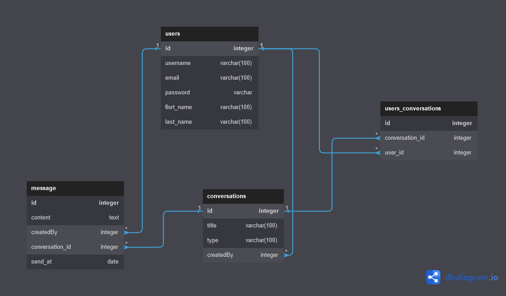

# CHAT API

API de chat no en tiempo real creada con Node Js, Express, Sequelize, JWT & Bcrypt aplicando el uso de manejo de errores y autentificación con token.

## Diagrama de la base de datos

## Features a implementar

✅ Definir relaciones de la base de datos.

✅ Crear los servicios para los usuarios.

    * Create a new User ☑️
    * User Login ☑️
    * Update User profile data ☑️
    * load profile picture☑️

✅ Crear Controlador para usuarios

    * Create a new User ☑️
    * User Login ☑️
    * Update User profile data ☑️
    * load profile picture ⚠️ (fix load profile picture)

✅ Crear las rutas para los usuarios.

    * Create a new User ☑️
    * User Login ☑️
    * Update User profile data ☑️
    * load profile picture ☑️

❌ Crear los servicios para los Chats.

    * Create a new Chat ❌
    * Create a new Group Chat ❌
    * Create service to get all chats of a user and their messages(couples) ❌
    * Create a service to get all chats, participants and their message(groups) ❌
    * Delete a chat ❌
    * Can add new users to group chat❗
    * Delete users from group chat❗

❌ Crear Controlador para los chats

❌ Crear las rutas para los chats.

❌ Crear Servicios para los mensajes

    * Create a new message ❌

❌ Crear Controlador para los mensajes

❌ Crear las rutas para los mensajes.

✅ Crear validaciones para la creación de usuarios.

✅ Crear validaciones para el login de usuarios.

❌ Crear middleware de autentificación de login de usuarios.

❌ Crear middleware de manejo de errores.

✅ Crear Modelos de la Base de datos.

✅ Definir la configuración de la base de datos.

✅ Registro de Usuarios.

✅ Login de usuarios

❌ Lista de Contactos(Todos los usuarios registrados en la aplicación).

❌ Conversaciones en Pareja.

❌ Conversaciones Grupales.

❌ Listado de Chats en los que participa un usuario

❌ Obtener una Conversacion sus mensajes y los participantes de la misma.

❌ Crear mensaje dentro de una conversacion.

❌ Eliminar una conversacion.
