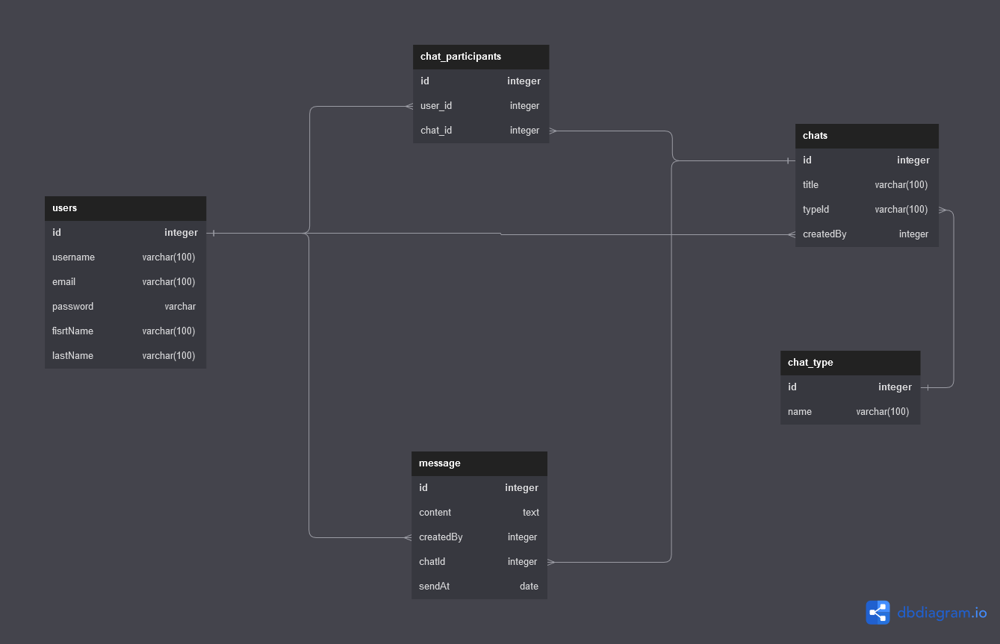

# CHAT API

API de chat no en tiempo real creada con Node Js, Express, Sequelize, JWT & Bcrypt.

## Diagrama de la base de datos

## Features a implementar

✅ Definir relaciones de la base de datos.

❌ Crear los servicios para los usuarios.

❌ Crear Controlador para usuarios

❌ Crear las rutas para los usuarios.

❌ Crear los servicios para las conversaciones.

❌ Crear Controlador para conversaciones

❌ Crear las rutas para las conversaciones.

❌ Crear los servicios para los chats

❌ Crear controlador para el chat

❌ Crear las rutas para el chat

❌ Crear validaciones para la creación de usuarios.

❌ Crear validaciones para el login de usuarios.

❌ Crear middleware de autentificación de login de usuarios.

❌ Crear middleware de manejo de errores.

❌ Crear Modelos de la Base de datos.

✅ Definir la configuración de la base de datos.

❌ Registro de Usuarios.

❌ Login de usuarios

❌ Lista de Contactos(Todos los usuarios registrados en la aplicación).

❌ Conversaciones en Pareja.

❌ Conversaciones Grupales.

❌ Listado de Chats en los que participa un usuario

❌ Obtener una Conversacion sus mensajes y los participantes de la misma.

❌ Crear mensaje dentro de una conversacion.

❌ Eliminar una conversacion.
